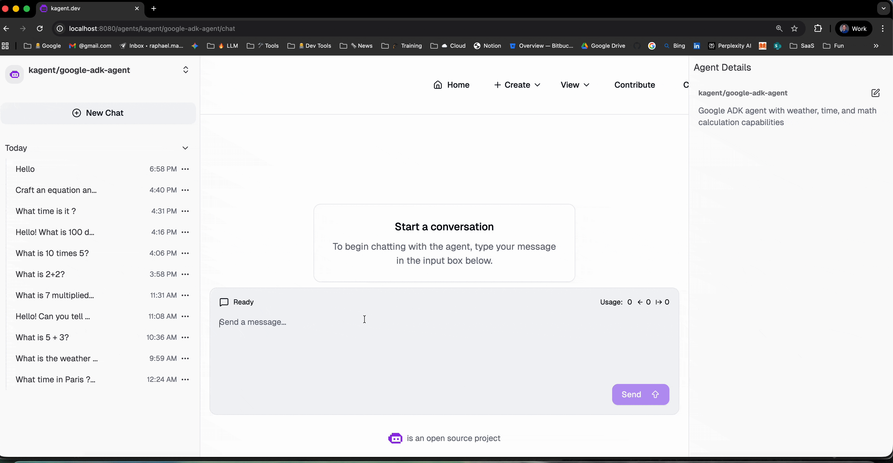

# k8s-agent-stack

[](LICENSE)
[](https://github.com/kagent-dev/kagent)
[](https://knative.dev)

**k8s-agent-stack** is a sovereign, Kubernetes-native platform for deploying, orchestrating, and scaling AI agents. It provides a production-grade environment for multi-agent systems with built-in support for agent-to-agent (A2A) communication, scale-to-zero capabilities, and data sovereignty.



---

## 🚀 Overview

The platform enables developers to move from local AI experimentation to production-grade agentic infrastructure in minutes. It integrates best-in-class CNCF projects with a specialized agent orchestration layer.

### Key Capabilities

- **🔐 Data Sovereignty**: Run on your own infrastructure (Local, On-Prem, or Cloud). Your data never leaves your control.
- **🚀 Serverless Execution**: Built on Knative for automatic scaling and scale-to-zero (pay-only-for-what-you-use).
- **🤖 Multi-Framework Support**: Native support for Google ADK, LangGraph, CrewAI, and custom agent runtimes.
- **🔄 A2A Protocol**: Standardized agent-to-agent communication protocol for complex multi-agent workflows.
- **🔭 Enterprise Ready**: Built-in RBAC, quota management, audit logging, and OpenTelemetry observability.

---

## 🛠️ Project Structure

The repository is organized into several key components:

- **[agentstack/](agentstack/)**: The core API Gateway and Worker orchestration layer.
- **[deploy/](deploy/)**: Kubernetes manifests and deployment configurations.
- **[docs/](docs/)**: Comprehensive documentation, architecture guides, and tutorials.
- **[kagent-adk-agent/](kagent-adk-agent/)**: A reference implementation of an agent using Google ADK.
- **[scripts/](scripts/)**: Automation scripts for cluster setup and maintenance.

---

## 🏁 Quick Start

### 1. Prerequisites

- Kubernetes cluster (OrbStack, GKE, EKS, or local)
- `kubectl`, `helm`, and `go` installed
- OpenAI API Key (or other supported LLM provider)

### 2. Installation

```bash
# Clone the repository
git clone https://github.com/raphaelmansuy/k8s-agent-stack.git
cd k8s-agent-stack

# Install development tools (optional, for developers)
make install-tools

# Set your API key
export OPENAI_API_KEY="your-key-here"

# Run the automated setup
make start
```

### 3. Access the UI

The platform includes a comprehensive web interface for managing agents and conversations.

```bash
# Start the UI with automatic port-forwarding
make ui
```

Access the UI at: **[http://localhost:8080](http://localhost:8080)**

---

## 📖 Documentation

| Guide                                            | Description                                            |
| ------------------------------------------------ | ------------------------------------------------------ |
| **[Getting Started](docs/getting-started.md)**   | Detailed installation and setup instructions.          |
| **[Architecture](docs/architecture.md)**         | Deep dive into the 5-layer platform design.            |
| **[Deployment Guide](docs/deployment-guide.md)** | Production deployment, traffic splitting, and scaling. |
| **[ADK Agent Guide](docs/adk-guide.md)**         | Building and deploying Google ADK agents.              |
| **[UI Access Guide](docs/KAGENT_UI_ACCESS.md)**  | Detailed information on using the Kagent UI.           |
| **[Troubleshooting](docs/troubleshooting.md)**   | Common issues and their resolutions.                   |

---

## 🤝 Contributing & Governance

This is an **Apache 2.0** licensed open-source project. We welcome contributions from the community.

- **[Contributing Guidelines](CONTRIBUTING.md)**: How to get started with contributions.
- **[Code of Conduct](CONTRIBUTING.md#code-of-conduct)**: Our commitment to a welcoming environment.
- **[Governance](docs/governance.md)**: Project governance and decision-making process.

### Maintainers

- **[Raphaël MANSUY](https://www.linkedin.com/in/raphaelmansuy/)** - Project Lead

---

## 📄 License

Copyright © 2025 Raphaël MANSUY.

Licensed under the Apache License, Version 2.0 (the "License"); you may not use this file except in compliance with the License. You may obtain a copy of the License at [LICENSE](LICENSE).

Unless required by applicable law or agreed to in writing, software distributed under the License is distributed on an "AS IS" BASIS, WITHOUT WARRANTIES OR CONDITIONS OF ANY KIND, either express or implied. See the License for the specific language governing permissions and limitations under the License.
