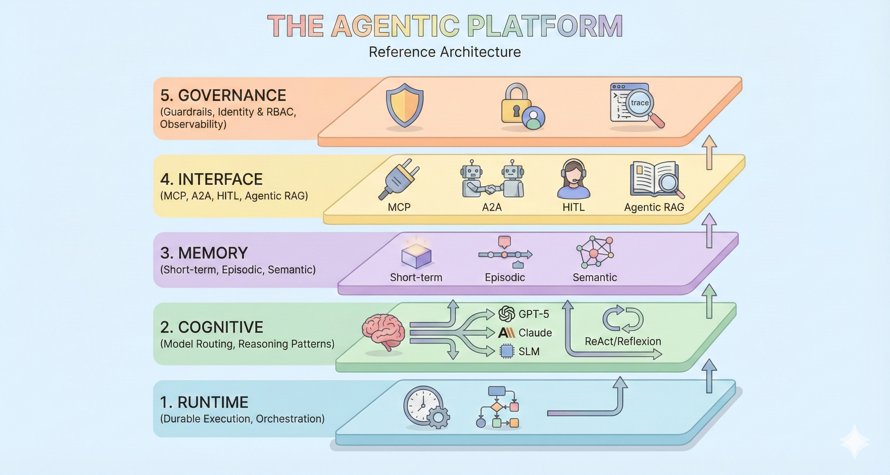

# Architecture

k8s-agent-stack implements a 5-layer architecture for sovereign AI agents, based on the Agentic Platform Reference Architecture (2025).



## Overview

```
┌────────────────────────────────────────────────────────────┐
│  YOUR AGENTS (Google ADK │ LangGraph │ CrewAI │ Custom)    │
├────────────────────────────────────────────────────────────┤
│  kagent: A2A Protocol • Multi-Framework • Discovery        │
├────────────────────────────────────────────────────────────┤
│  Knative: Scale-to-Zero • Auto-Scaling • Traffic Mgmt      │
├────────────────────────────────────────────────────────────┤
│  Kubernetes: OrbStack │ GKE │ EKS │ AKS │ On-Prem          │
└────────────────────────────────────────────────────────────┘
```

---

## The 5 Layers

| Layer | Purpose | Status |
|-------|---------|--------|
| **5. GOVERNANCE** | Security, compliance, observability | 🚧 In Progress |
| **4. INTERFACE** | Agent communication & interaction | ✅ Partial |
| **3. MEMORY** | Agent state & knowledge management | 📋 Planned |
| **2. COGNITIVE** | Reasoning & decision-making | 🚧 In Progress |
| **1. RUNTIME** | Execution & orchestration | ✅ Production |

---

## Layer 1: RUNTIME

**Status**: ✅ Production Ready

The foundation layer handles container orchestration, serverless execution, and infrastructure portability.

### Components

| Component | Purpose |
|-----------|---------|
| **Kubernetes** | Container orchestration |
| **Knative Serving** | Scale-to-zero, auto-scaling, traffic management |
| **Contour + Envoy** | L7 routing, load balancing |
| **metrics-server** | Resource monitoring for autoscaling |

### Key Features

- **Scale-to-zero**: Pods scale down when idle, reducing costs
- **Auto-scaling**: From 0 to 1000+ concurrent requests
- **Traffic management**: Canary deployments, blue-green, A/B testing
- **Multi-cloud**: Works on GKE, EKS, AKS, on-prem, local

### How It Works

```
User Request
     │
     v
┌─────────────┐
│   Envoy     │  L7 Load Balancer
└─────────────┘
     │
     v
┌─────────────┐
│  Activator  │  Buffers requests when scaling from zero
└─────────────┘
     │
     v
┌─────────────┐
│ Queue-Proxy │  Sidecar in each pod, reports metrics
└─────────────┘
     │
     v
┌─────────────┐
│ Your Agent  │  Container running your code
└─────────────┘
```

---

## Layer 2: COGNITIVE

**Status**: 🚧 In Progress

The cognitive layer handles agent reasoning, decision-making, and LLM interactions.

### Current Components

| Component | Purpose |
|-----------|---------|
| **Google ADK** | Structured agent development |
| **Gemini** | LLM backbone (via ADK) |

### Planned Components (Q1 2025)

- **LangGraph**: Complex agent workflows
- **CrewAI**: Multi-agent orchestration
- **AutoGen**: Microsoft's agent framework
- **Model routing**: GPT-4, Claude, local SLMs

### Agent Patterns

```
┌─────────────────────────────────────────┐
│           COGNITIVE LAYER               │
├─────────────────────────────────────────┤
│  ┌──────────┐  ┌──────────┐  ┌────────┐│
│  │  ReAct   │  │Reflection│  │  CoT   ││
│  └──────────┘  └──────────┘  └────────┘│
│                    │                    │
│  ┌─────────────────v──────────────────┐│
│  │         Agent Framework            ││
│  │  (Google ADK / LangGraph / CrewAI) ││
│  └─────────────────┬──────────────────┘│
│                    │                    │
│  ┌─────────────────v──────────────────┐│
│  │           LLM Provider             ││
│  │  (Gemini / GPT / Claude / Local)   ││
│  └────────────────────────────────────┘│
└─────────────────────────────────────────┘
```

---

## Layer 3: MEMORY

**Status**: 📋 Planned (Q1 2025)

The memory layer provides agents with state and knowledge management.

### Planned Components

| Type | Technology | Purpose |
|------|------------|---------|
| **Short-term** | Redis | Session state, fast cache |
| **Episodic** | PostgreSQL | Conversation history, event logs |
| **Semantic** | Vector DB | Embeddings, similarity search |
| **Knowledge** | Graph DB | Entity relationships |

### Memory Architecture

```
┌─────────────────────────────────────────┐
│           MEMORY LAYER                  │
├─────────────────────────────────────────┤
│  ┌──────────────────────────────────┐   │
│  │         Short-term Memory        │   │
│  │  (Redis: sessions, cache)        │   │
│  └──────────────────────────────────┘   │
│  ┌──────────────────────────────────┐   │
│  │         Episodic Memory          │   │
│  │  (Conversation history, logs)    │   │
│  └──────────────────────────────────┘   │
│  ┌──────────────────────────────────┐   │
│  │         Semantic Memory          │   │
│  │  (Vector DB: Pinecone, Weaviate) │   │
│  └──────────────────────────────────┘   │
└─────────────────────────────────────────┘
```

---

## Layer 4: INTERFACE

**Status**: ✅ Partial

The interface layer enables agent-to-agent communication and external integrations.

### Current Components

| Component | Purpose |
|-----------|---------|
| **kagent** | A2A protocol for agent-to-agent messaging |
| **Google ADK** | Structured input/output |
| **FastAPI** | REST/HTTP endpoints |
| **SSE** | Server-Sent Events for streaming |

### Planned Components (Q1 2025)

- **MCP**: Model Context Protocol
- **HITL**: Human-in-the-Loop workflows
- **WebSocket**: Real-time bidirectional communication
- **Agentic RAG**: Retrieval-augmented generation

### A2A Protocol

[kagent](https://github.com/kagent-dev/kagent) enables agents to discover and communicate with each other:

```
┌──────────┐    A2A Protocol    ┌──────────┐
│ Agent A  │ <---------------- │ Agent B  │
│          │ ----------------> │          │
└──────────┘                    └──────────┘
     │                               │
     └───────────┬───────────────────┘
                 │
         ┌───────v───────┐
         │    kagent     │
         │  (Discovery)  │
         └───────────────┘
```

---

## Layer 5: GOVERNANCE

**Status**: 🚧 In Progress

The governance layer ensures security, compliance, and observability.

### Current Components

| Component | Purpose |
|-----------|---------|
| **kubectl logs** | Basic logging |
| **Kubernetes events** | System events |
| **metrics-server** | Resource metrics |

### Planned Components

| Component | Purpose | Timeline |
|-----------|---------|----------|
| **Prometheus** | Metrics collection | Q1 2025 |
| **Grafana** | Dashboards | Q1 2025 |
| **RBAC policies** | Access control | Q1 2025 |
| **Guardrails** | Safety checks | Q2 2025 |
| **Audit logging** | Compliance | Q2 2025 |
| **Cost tracking** | LLM usage | Q2 2025 |

---

## System Interaction Flow

```
┌─────────────────────────────────────────────────────────────────┐
│                    5. GOVERNANCE (Monitoring)                   │
│                    Observability + RBAC + Guardrails            │
└───────────────────┬─────────────────────────────────────────────┘
                    │ (Monitors all layers)
                    v
┌─────────────────────────────────────────────────────────────────┐
│                         Internet / Users                        │
└────────────────────────────┬────────────────────────────────────┘
                             │
                   ┌─────────v─────────┐
                   │  4. INTERFACE     │
                   │  A2A + REST + SSE │
                   └─────────┬─────────┘
                             │
         ┌───────────────────┼───────────────────┐
         │                   │                   │
    ┌────v─────┐      ┌─────v──────┐     ┌─────v──────┐
    │  Agent 1 │      │  Agent 2   │     │  Agent N   │
    │          │      │            │     │            │
    │  ┌───────┴──────┴────────────┴─────┴───────┐    │
    │  │  2. COGNITIVE (Reasoning)               │    │
    │  │  Google ADK + Gemini                    │    │
    │  └─────────────────┬───────────────────────┘    │
    │                    │                            │
    │  ┌─────────────────v───────────────────────┐    │
    │  │  3. MEMORY (State)                      │    │
    │  │  ConfigMaps + Secrets + (Redis planned) │    │
    │  └─────────────────────────────────────────┘    │
    └────┬─────┘      └─────┬──────┘     └─────┬──────┘
         │                  │                   │
    ┌────v──────────────────v───────────────────v─────┐
    │         1. RUNTIME (Knative Serving)            │
    │  Scale-to-Zero + Auto-scaling + Orchestration   │
    └────────────────────┬────────────────────────────┘
                         │
    ┌────────────────────v────────────────────────────┐
    │     Kubernetes + Contour/Envoy + Infrastructure │
    └─────────────────────────────────────────────────┘
```

---

## Key Technologies

### kagent

[kagent](https://github.com/kagent-dev/kagent) is a CNCF project for Kubernetes-native AI agent orchestration:

- **A2A Protocol**: Open standard for agent-to-agent communication
- **Multi-framework**: Supports Google ADK, and planned support for LangGraph, CrewAI
- **MCP Tools**: Integrates with Kubernetes, Istio, Helm, Prometheus
- **Observability**: OpenTelemetry tracing support

### Knative Serving

[Knative Serving](https://knative.dev/docs/serving/) provides serverless execution:

- **Services**: High-level abstraction managing routing and scaling
- **Revisions**: Immutable snapshots of code and configuration
- **Routes**: Traffic routing between revisions
- **Configurations**: Desired state for deployments

### Contour + Envoy

[Contour](https://projectcontour.io/) provides L7 ingress:

- **HTTPProxy**: Advanced routing rules
- **TLS termination**: Certificate management
- **Rate limiting**: Protect against abuse
- **Load balancing**: Distribute traffic across pods

---

## Further Reading

- [kagent Documentation](https://kagent.dev/docs/)
- [Knative Serving Docs](https://knative.dev/docs/serving/)
- [Contour Documentation](https://projectcontour.io/docs/)
- [Building ADK Agents](building-google-adk-agents-for-kagent.md)

---

[← Back to Documentation Index](README.md) • [Getting Started](getting-started.md) • [Deployment Guide](deployment-guide.md) • [Main README](../README.md)
