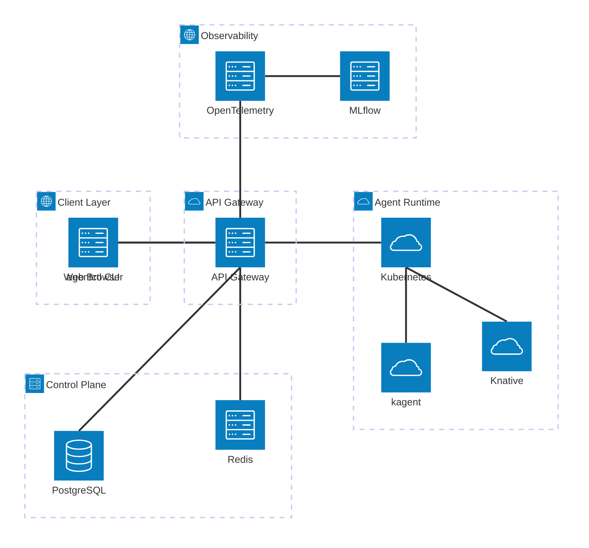

# AgentStack Architecture

AgentStack is a sovereign AI agent platform providing a "Cloud Run-like" experience for AI agents on Kubernetes. This document describes the architecture as implemented in the codebase.

## 🗺️ Architecture Map

This document serves as the master architecture reference. For deep dives into specific subsystems, refer to the following specialized documents:

| Component | Deep Dive Document | Focus Area |
|-----------|-------------------|------------|
| **API Gateway** | [architecture/api-gateway.md](architecture/api-gateway.md) | Go/Chi/Huma API, Middleware, Auth, RBAC |
| **Agent Runtime** | [architecture/agent-runtime.md](architecture/agent-runtime.md) | kagent vs Knative, Agent CRDs, Scaling |
| **A2A Protocol** | [architecture/a2a-protocol.md](architecture/a2a-protocol.md) | JSON-RPC, SSE, Discovery, Streaming |
| **Control Plane** | [architecture/control-plane.md](architecture/control-plane.md) | Postgres, Redis, Reconciliation Loop |
| **UI Integration** | [architecture/ui-integration.md](architecture/ui-integration.md) | Kagent UI, Nginx Proxy, Port-Forwarding |
| **Data Flow** | [architecture/data-flow.md](architecture/data-flow.md) | Request Lifecycle, Streaming, Telemetry |
| **Security** | [architecture/security.md](architecture/security.md) | Auth, RBAC, Multi-tenancy, Secrets |
| **Observability** | [architecture/observability.md](architecture/observability.md) | Logging, Tracing, Metrics, MLflow |

---

## System Overview

## Core Components

The AgentStack platform is composed of several modular components that work together to provide a seamless agent orchestration experience.

### 1. API Gateway
The central entry point for all operations. Built with Go, `chi`, and `huma`. It handles authentication, RBAC, and provides a type-safe OpenAPI interface.
- See [API Gateway Deep Dive](architecture/api-gateway.md)

### 2. Agent Runtime
Manages the lifecycle of agents using a dual-mode strategy (kagent or Knative). It handles deployment, scaling, and resource management.
- See [Agent Runtime Deep Dive](architecture/agent-runtime.md)

### 3. A2A Protocol
A standardized communication layer based on JSON-RPC 2.0 over HTTP/SSE, enabling agents to interact in real-time.
- See [A2A Protocol Deep Dive](architecture/a2a-protocol.md)

### 4. Control Plane
The state management and reconciliation engine. It uses PostgreSQL for persistence and Redis for caching and task queuing.
- See [Control Plane Deep Dive](architecture/control-plane.md)

### 5. Kagent Web UI Integration
A rich dashboard for interacting with agents and managing the cluster, optimized for streaming and cross-namespace connectivity.
- See [UI Integration Deep Dive](architecture/ui-integration.md)

## Data Flow: Request Lifecycle
Detailed request lifecycles for deployment, streaming, and telemetry are documented in the [Data Flow Deep Dive](architecture/data-flow.md).

## Security & Multi-Tenancy
AgentStack provides robust security through JWT/API Key authentication, hierarchical RBAC, and database-level tenant isolation.
- See [Security Deep Dive](architecture/security.md)

## Observability
Comprehensive monitoring via OpenTelemetry, structured logging, and AI-specific evaluation with MLflow.
- See [Observability Deep Dive](architecture/observability.md)

## Agent Implementation (`kagent-adk-agent`)
Reference implementation using Google ADK and FastAPI.
- **A2A Middleware**: Intercepts standard requests to provide A2A-compliant JSON-RPC and SSE streaming.
- **Runner**: Orchestrates the agent's reasoning loop and tool execution.
- **Telemetry**: Integrated OpenTelemetry for distributed tracing.
