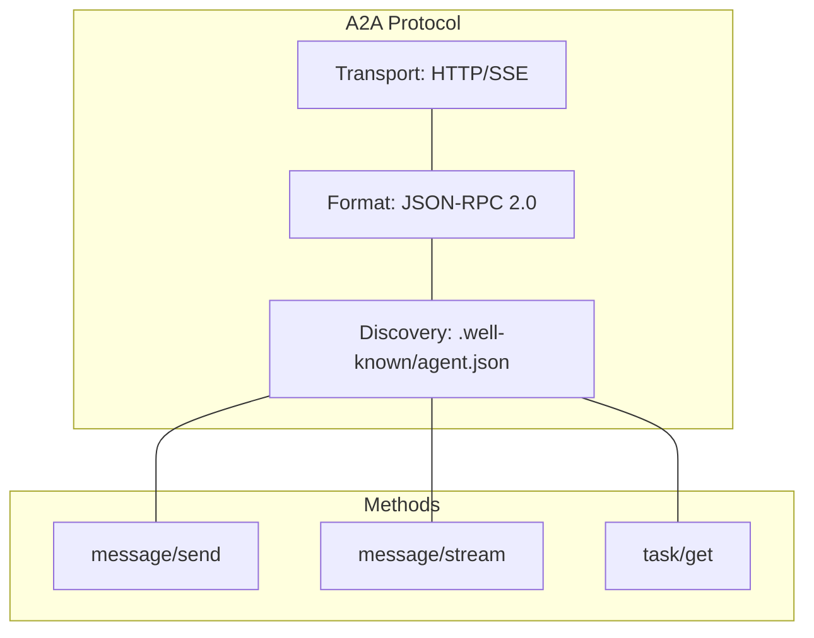

# Agent-to-Agent (A2A) Protocol

[← Back to Master Architecture](../architecture.md)

The A2A protocol is the standardized communication layer that enables agents to discover, call, and stream data to each other. It is designed to be language-agnostic and optimized for the streaming nature of LLM interactions.

## Protocol Specification



- **Transport**: HTTP/1.1 or HTTP/2.
- **Message Format**: JSON-RPC 2.0.
- **Streaming**: Server-Sent Events (SSE).
- **Discovery**: `.well-known/agent.json` (Agent Card).

## Core Methods

| Method | Description | Payload (JSON-RPC Params) |
|--------|-------------|---------------------------|
| `message/send` | Sends a synchronous message to an agent. | `{ "message": { "parts": [{ "kind": "text", "text": "..." }] } }` |
| `message/stream` | Initiates a streaming response from an agent. | `{ "message": { "parts": [{ "kind": "text", "text": "..." }] }, "stream": true }` |
| `task/get` | Retrieves the status of a long-running task. | `{ "taskId": "..." }` |
| `task/cancel` | Cancels an ongoing task. | `{ "taskId": "..." }` |

## Streaming with SSE

For real-time interactions, the protocol uses SSE. Each event in the stream is a valid JSON-RPC response object. The `result` or `params` contains the message parts.

```text
event: message
data: {"jsonrpc": "2.0", "method": "message/stream", "params": {"taskId": "...", "status": {"state": "working", "message": {"parts": [{"kind": "text", "text": "Hello"}]}}}}

event: message
data: {"jsonrpc": "2.0", "method": "message/stream", "params": {"taskId": "...", "status": {"state": "working", "message": {"parts": [{"kind": "text", "text": " world"}]}}}}

event: message
data: {"jsonrpc": "2.0", "method": "message/stream", "params": {"taskId": "...", "status": {"state": "completed"}, "final": true}}
```

## Agent Discovery (The Agent Card)

Every A2A-compliant agent must expose an "Agent Card" at `/.well-known/agent.json`. This card allows the platform and other agents to understand its capabilities.

```json
{
  "name": "research-agent",
  "version": "1.0.0",
  "description": "Performs web research and summarization",
  "tools": [
    {
      "name": "web_search",
      "description": "Search the web for information",
      "parameters": {
        "type": "object",
        "properties": {
          "query": { "type": "string" }
        }
      }
    }
  ],
  "endpoints": {
    "a2a": "/api/a2a"
  }
}
```

## Implementation in AgentStack (`agentstack/internal/domain/a2a`)

The `a2a` domain in AgentStack provides:
- **Service Discovery**: Resolving agent names to internal Kubernetes cluster IPs.
- **Protocol Bridging**: Facilitating communication between the Web UI and agents.
- **Validation**: Ensuring that messages conform to the JSON-RPC 2.0 spec.

## Production Considerations

When deploying A2A agents behind proxies (like Nginx or Envoy):
1. **Disable Buffering**: `proxy_buffering off` must be set to ensure SSE events are delivered immediately.
2. **Preserve Methods**: Proxies must be configured to avoid 301 redirects that convert `POST` requests to `GET`, as A2A calls often carry large JSON payloads in the body.
3. **Keep-Alive**: Long-lived connections should be supported to avoid frequent reconnections during long LLM generations.

---

## Further Reading

- **[Kagent + Google ADK + A2A Deep Dive](../kagent-adk-a2a-architecture.md)**: A comprehensive guide to building and orchestrating production-grade agents.
