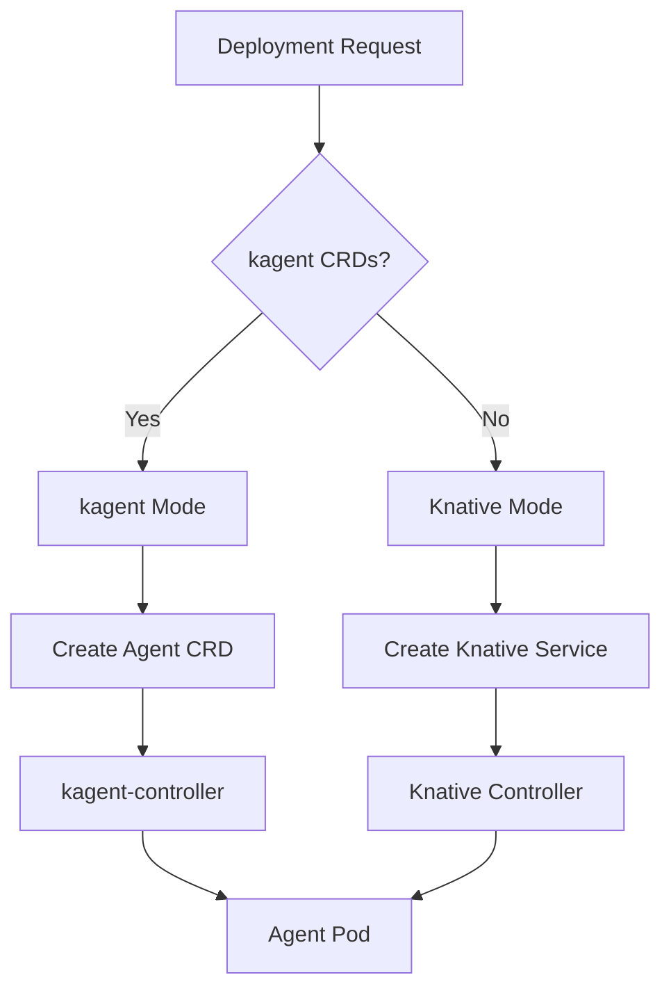

# Agent Runtime Architecture

[← Back to Master Architecture](../architecture.md)

The Agent Runtime is responsible for the lifecycle, execution, and scaling of AI agents. It provides a "Cloud Run-like" experience by abstracting the underlying Kubernetes infrastructure.

## Dual-Mode Orchestration

AgentStack supports two primary orchestration modes, allowing it to adapt to the capabilities of the target Kubernetes cluster.

### 1. kagent Mode (Native)
If the **kagent** controller and CRDs are installed, AgentStack uses the `Agent` custom resource (`kagent.dev/v1alpha2`) as the primary deployment primitive.

- **Declarative Management**: Agents are managed as high-level objects rather than low-level Pods or Deployments.
- **Integrated A2A**: Native support for the [Agent-to-Agent protocol](a2a-protocol.md).
- **Tool Discovery**: Automatic registration of agent tools within the kagent ecosystem.

### 2. Knative Mode (Fallback)
If `kagent` is not present, the runtime falls back to **Knative Serving**.

- **Scale-to-Zero**: Agents are automatically scaled down to zero replicas when idle, saving costs.
- **Request-Based Scaling**: Rapidly scales up based on incoming request concurrency.
- **Traffic Management**: Built-in support for blue/green deployments and traffic splitting.

## Deployment Types

The runtime supports three distinct types of agents:

| Type | Description | Use Case |
|------|-------------|----------|
| **BYO** | "Bring Your Own" container. | Custom agent logic, specialized runtimes, or legacy migrations. |
| **LLM** | Pre-configured agent with model settings. | Simple prompt-based agents using OpenAI, Gemini, or Anthropic. |
| **ADK** | Built with Google Agent Development Kit. | Agents requiring structured tool use and standardized A2A communication. |

## Resource Management

The runtime enforces resource constraints to ensure cluster stability and multi-tenant isolation:

- **CPU/Memory Limits**: Defined in the `AgentDeployment` spec and mapped to Kubernetes resource limits.
- **Environment Variables**: Securely injected into agent containers from the database or Kubernetes Secrets.
- **Probes**: Liveness and readiness probes are automatically configured to ensure traffic is only routed to healthy agents.

## Implementation Details (`agentstack/internal/domain/deployment`)

- **`service.go`**: The core logic for reconciling the desired agent state with the Kubernetes cluster. It detects the cluster capabilities and chooses the appropriate deployment strategy.
- **`k8s/client.go`**: A wrapper around the Kubernetes client-go library, providing a simplified interface for managing `Agent` and `Service` resources.

## Lifecycle Phases

Agents transition through the following phases (see [Data Flow](data-flow.md) for the detailed sequence):

1. **Pending**: Deployment request received, resources being allocated.
2. **Creating**: Kubernetes resources (CRDs, Services, Pods) are being created.
3. **Ready**: Agent is healthy and reachable via its assigned URL.
4. **Failed**: Deployment failed due to configuration errors or resource exhaustion.
5. **Deleting**: Resources are being cleaned up.
