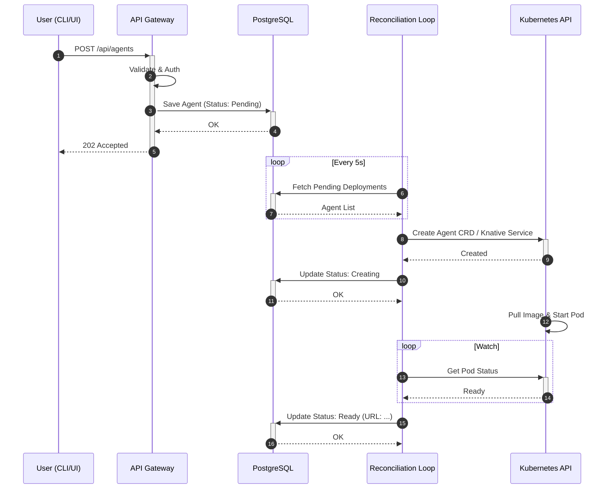
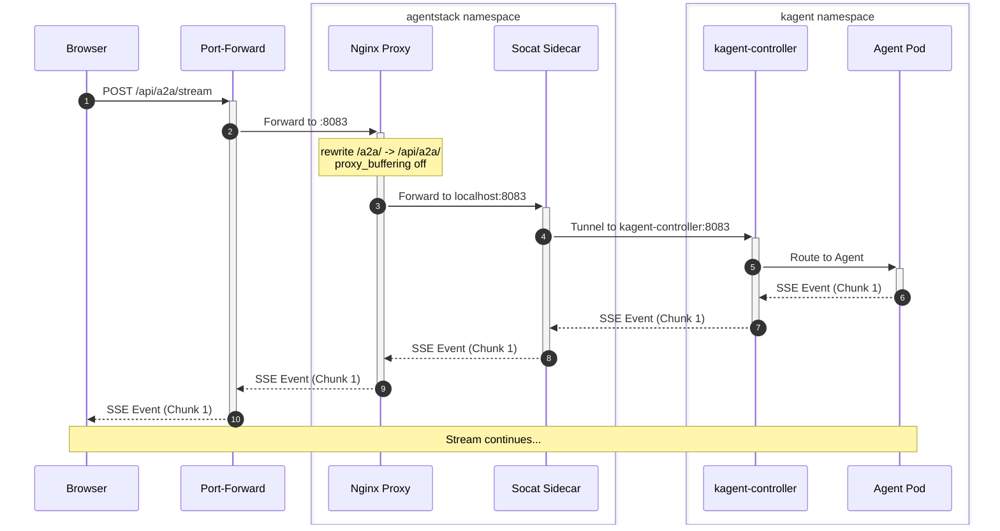

# Data Flow & Request Lifecycle

This document describes how data moves through the AgentStack system during common operations.

## 1. Agent Deployment Flow

When a user deploys a new agent via `agentctl deploy` or the API:

1. **CLI/UI** sends a `POST /api/agents` request with the agent spec.
2. **API Gateway** validates the request, checks Auth/RBAC, and verifies Quotas.
3. **Control Plane** writes the agent definition to **PostgreSQL** with status `Pending`.
4. **Reconciliation Loop** detects the new entry.
5. **Deployment Service** checks for `kagent` CRDs in the cluster.
6. **Kubernetes API** is called to create either an `Agent` CRD or a `Knative Service`.
7. **Control Plane** updates the database status to `Creating`.
8. **Kubernetes** pulls the image and starts the pod.
9. **Control Plane** (via watcher) detects the pod is `Ready` and updates the database with the final URL and status `Ready`.

## 2. A2A Streaming Request Flow

When the Web UI interacts with an agent:

1. **Browser** sends a `POST /api/a2a/stream` request to `localhost:8083`.
2. **Port-Forward** tunnels the request to the **UI Pod** in the cluster.
3. **Nginx Proxy** (inside the UI pod) receives the request.
4. **Nginx** applies rewrite rules and forwards the request to the **socat sidecar**.
5. **Socat** tunnels the request across namespaces to the **kagent-controller**.
6. **kagent-controller** identifies the target agent and routes the request to the **Agent Pod**.
7. **Agent Pod** processes the request and starts streaming **SSE events**.
8. **Streaming Response** flows back through the same path: Agent -> Controller -> Socat -> Nginx -> Port-Forward -> Browser.
9. **Nginx** (with `proxy_buffering off`) ensures each SSE chunk is delivered immediately.

## 3. Telemetry & Observability Flow

1. **API/Agent** generates traces and metrics using the **OpenTelemetry SDK**.
2. **Telemetry Middleware** captures request duration, status codes, and errors.
3. **Otel Collector** (if configured) receives the data via OTLP.
4. **MLflow Adapter** captures agent execution traces and evaluation metrics.
5. **MLflow Server** stores the traces for later analysis and visualization.

## 4. Auth & RBAC Flow

1. **Request** arrives at the API Gateway with an `Authorization` header.
2. **Auth Middleware** extracts the JWT or API Key.
3. **API Key Lookup** (via `auth.Service`) verifies the key against **PostgreSQL**.
4. **RBAC Middleware** checks if the identified Team/Project has permission for the requested action.
5. **Context Injection**: The `TeamID` and `ProjectID` are injected into the Go `context.Context`.
6. **Tenant Middleware** uses the context to ensure all database queries are scoped to the correct tenant.
