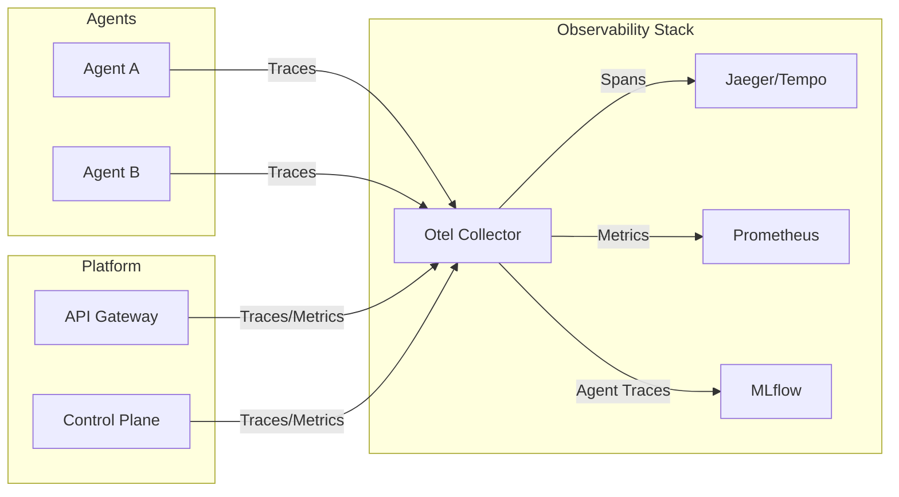

# Observability Architecture

[← Back to Master Architecture](../architecture.md)

AgentStack provides comprehensive observability into the health, performance, and behavior of the platform and the agents running on it.

## 1. Logging

The platform uses structured logging to ensure that logs are machine-readable and easily searchable.

- **API Gateway**: Uses [Zap](https://github.com/uber-go/zap) for high-performance structured logging.
- **Domain Services**: Use [Slog](https://pkg.go.dev/log/slog) (Go's standard structured logging) for better interoperability.
- **Agent Logs**: Collected by Kubernetes and accessible via `kubectl logs` or the Web UI.

## 2. Telemetry (Tracing & Metrics)

AgentStack is instrumented with **OpenTelemetry (Otel)**.

- **Distributed Tracing**: Tracks requests as they flow from the API Gateway to the Control Plane and out to the Kubernetes API.
- **Metrics**: Captures key performance indicators (KPIs) such as:
    - Request latency (p50, p95, p99).
    - Request volume and error rates.
    - Agent deployment success/failure rates.
    - Resource usage (CPU/Memory).

## 3. Agent Evaluation (MLflow)

For AI-specific observability, AgentStack integrates with **MLflow**.

- **Traces**: Captures the internal execution steps of an agent (e.g., tool calls, LLM prompts, and responses).
- **Evaluation**: Allows developers to run evaluation pipelines against agent outputs to measure accuracy and safety.
- **Integration**: The `evaluation` domain in AgentStack provides a bridge between the agent runtime and the MLflow server.

## 4. Health Monitoring

- **Liveness/Readiness Probes**: Kubernetes-native probes ensure that traffic is only routed to healthy agent pods.
- **API Health Check**: The Gateway exposes a `/health` endpoint for monitoring the status of the API and its dependencies (Postgres, Redis).

## 5. Audit Logging

Every administrative action (e.g., creating an agent, deleting a project, rotating an API key) is recorded in the **Audit Log**.

- **Actor**: Who performed the action.
- **Action**: What was done (e.g., `agent.create`).
- **Resource**: Which resource was affected.
- **Changes**: A diff of the changes made.
- **Timestamp**: When the action occurred.

Audit logs are stored in PostgreSQL and are immutable.
