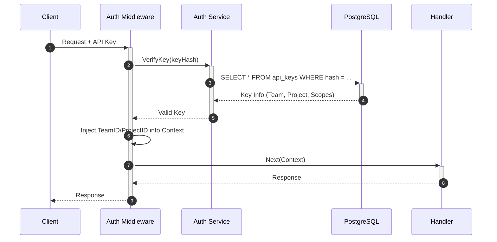

# Security Architecture

[← Back to Master Architecture](../architecture.md)

AgentStack is built with a "Security First" mindset, providing robust authentication, authorization, and multi-tenant isolation.

## 1. Authentication

The platform supports two primary authentication methods:

### JWT (JSON Web Tokens)
Used primarily for user-facing interactions (e.g., Web UI).
- **Issuance**: Handled by an external OIDC provider or the internal Auth service.
- **Validation**: The API Gateway verifies the signature and expiration of the token.

### API Keys
Used for programmatic access and agent-to-agent communication.

- **Storage**: Keys are hashed (SHA-256) before being stored in PostgreSQL.
- **Scopes**: Each key can be restricted to specific actions (e.g., `agents:read`, `deploy:write`).
- **Rotation**: Supported via the API and CLI.

## 2. Authorization (RBAC)

AgentStack implements a hierarchical Role-Based Access Control system.

- **Teams**: The top-level administrative unit.
- **Projects**: Logical groupings of agents and resources within a team.
- **Roles**:
    - `Owner`: Full access to all team resources.
    - `Editor`: Can deploy and manage agents but cannot manage team settings.
    - `Viewer`: Read-only access to agents and logs.

### Implementation (`internal/domain/rbac`)
Permissions are checked at the API Gateway level using a specialized middleware. The middleware ensures that the authenticated entity has the required scope for the target resource.

## 3. Multi-Tenancy Isolation

Multi-tenancy is enforced at multiple layers:

### Database Layer
Every table in the PostgreSQL database includes a `tenant_id` column. The `TenantMiddleware` automatically appends a `WHERE tenant_id = ...` clause to all queries, ensuring that one tenant can never see another's data.

### Compute Layer (Kubernetes)
- **Namespaces**: Agents can be deployed into tenant-specific Kubernetes namespaces.
- **Resource Quotas**: Prevents a single tenant from consuming all cluster resources.
- **Network Policies**: (Optional) Restricts network traffic between agent pods of different tenants.

## 4. Secret Management

Sensitive information (API keys for LLM providers, database credentials) is never stored in plain text.
- **Kubernetes Secrets**: Used to inject sensitive data into agent containers.
- **Environment Variables**: Passed securely to the runtime.

## 5. API Security

- **Rate Limiting**: Enforced via the `quota` domain to prevent DoS attacks.
- **Input Validation**: Strict JSON Schema validation for all API requests.
- **CORS**: Configurable Cross-Origin Resource Sharing policies.
- **Audit Logging**: Every administrative action is recorded with the actor's identity, timestamp, and the changes made.
