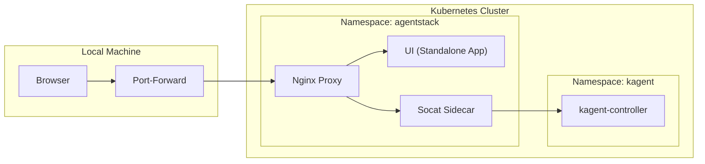

# Kagent Web UI Integration

[← Back to Master Architecture](../architecture.md)

AgentStack integrates the official Kagent Web UI to provide a rich, interactive dashboard for managing agents, viewing logs, and interacting with agents via the A2A protocol.

## Architecture

The UI is deployed as a standalone application within the `agentstack` namespace.

- **Image**: `cr.kagent.dev/kagent-dev/kagent/ui:0.7.7`
- **Framework**: Next.js (React)
- **Proxy**: Internal Nginx for routing and protocol bridging.

## Networking & Connectivity

Accessing the UI in a local development environment requires a complex networking setup, which is automated by the `agentctl ui` command.

### Quadruple Port-Forwarding
The UI requires four distinct ports to be forwarded to the local machine to ensure all features (SSR, API, and WebSockets) work correctly:

| Port | Purpose | Description |
|------|---------|-------------|
| **3000** | Main UI | The primary entry point for the browser. Routes to the internal Nginx proxy. |
| **8080** | API & SSR | Used by the Next.js frontend to communicate with the backend API via Nginx. |
| **8083** | A2A Tunnel | Direct tunnel to the `kagent-controller` for Agent-to-Agent protocol calls. |
| **8081** | WebSockets | Dedicated tunnel for real-time streaming updates and notifications. |

### Cross-Namespace Connectivity
The UI pod needs to communicate with the `kagent-controller` which resides in the `kagent` namespace. To facilitate this without complex DNS or Ingress setup, AgentStack uses **socat sidecars** within the UI pod.

- **Sidecar Containers**: Lightweight `socat` processes (`backend-proxy` and `ws-proxy`) running alongside the UI container.
- **Function**: They listen on local ports (8083 and 8081) and tunnel traffic to `kagent-controller.kagent.svc.cluster.local:8083`.
- **Benefit**: The UI application and Nginx proxy can simply talk to `127.0.0.1`, and the sidecars handle the cross-namespace routing.

## Nginx Proxy Tuning

To support the streaming nature of AI agents, the internal Nginx proxy is specifically tuned:

- **`proxy_buffering off`**: Essential for Server-Sent Events (SSE). Without this, Nginx would buffer the agent's response chunks, breaking the real-time streaming experience.
- **Trailing Slash Rewrites**: Custom `rewrite` rules ensure that requests to `/api/a2a/my-agent` are internally routed to `/api/a2a/my-agent/` without triggering a 301 redirect. This is critical because 301 redirects convert `POST` requests to `GET`, which would strip the A2A payload.

## Deployment Configuration (`deploy/agentstack-k8s.yaml`)

The UI deployment includes:
1. **ConfigMap**: Contains the tuned `nginx.conf`.
2. **Deployment**: Defines the UI container and the `socat` sidecars.
3. **Service**: A multi-port service exposing all four required ports.

## CLI Integration (`agentctl ui`)

The `agentctl` CLI simplifies UI access by:
1. Identifying the UI pod in the cluster.
2. Establishing the quadruple port-forward.
3. Opening the default browser to `http://localhost:3000`.
4. Managing the lifecycle of the port-forwarding processes.
