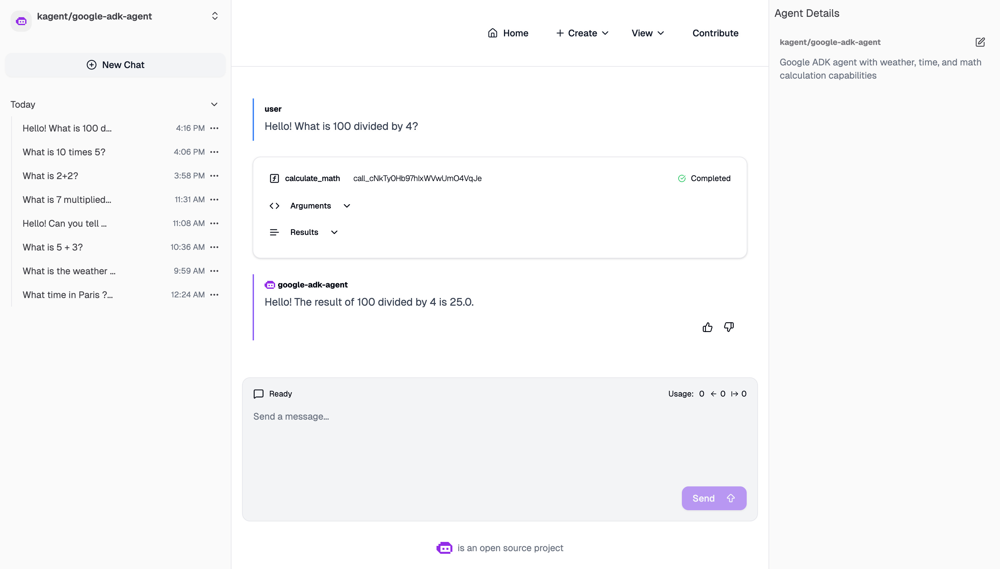
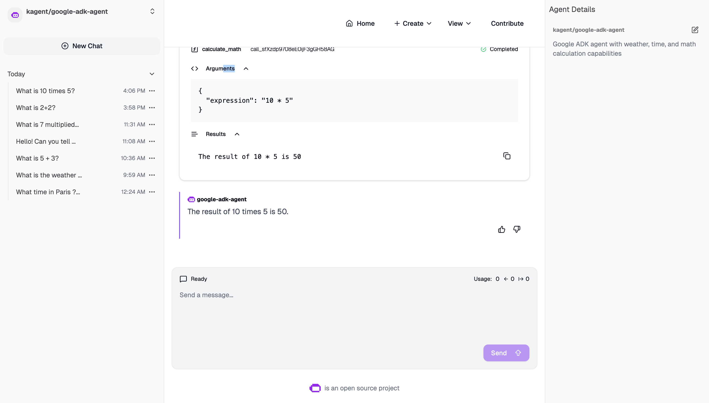

# Building Google ADK Agents for Kagent: A Complete Guide

<!--
Copyright 2025 Raphaël MANSUY
Licensed under the Apache License, Version 2.0
https://www.apache.org/licenses/LICENSE-2.0
-->

> **From Zero to Deployed**: How to build AI agents using Google's Agent Development Kit (ADK) and deploy them to Kagent's unified agent platform.

## Table of Contents

1. [What is Kagent?](#what-is-kagent)
2. [The Problem Kagent Solves](#the-problem-kagent-solves)
3. [Key Concepts & Mental Models](#key-concepts--mental-models)
4. [Google ADK Overview](#google-adk-overview)
5. [Project Setup](#project-setup)
6. [Building the Agent](#building-the-agent)
7. [A2A Protocol Integration](#a2a-protocol-integration)
8. [Containerization](#containerization)
9. [Deploying to Kagent](#deploying-to-kagent)
10. [Testing in Kagent UI](#testing-in-kagent-ui)

---

## What is Kagent?

**Kagent** is an open-source, Kubernetes-native platform for managing and orchestrating AI agents. It provides:

- **Unified Web UI** for interacting with multiple AI agents
- **Kubernetes Custom Resource Definitions (CRDs)** for declarative agent management
- **A2A Protocol Support** for standardized agent communication
- **BYO (Bring Your Own) Agent** capability for custom agent deployments
- **Tool management** and agent configuration through YAML manifests

For a detailed technical breakdown, see the [Architecture Overview](architecture.md) and the [Architecture Deep Dives](architecture/).

Think of Kagent as a "control plane" for AI agents—similar to how Kubernetes manages containers, Kagent manages AI agents.


*Kagent Web UI showing a conversation with a Google ADK agent*

---

## The Problem Kagent Solves

### Before Kagent

Building and deploying AI agents traditionally involves:

1. **Fragmented tooling**: Each agent framework has its own deployment model
2. **No unified interface**: Users need different UIs for different agents
3. **Complex infrastructure**: Managing agent lifecycles, scaling, and updates manually
4. **Protocol incompatibility**: Agents from different frameworks can't communicate

### After Kagent

With Kagent, you get:

| Challenge | Kagent Solution |
|-----------|-----------------|
| Fragmented tooling | Kubernetes-native CRDs for all agents |
| No unified interface | Single Web UI for all agents |
| Complex infrastructure | Declarative YAML-based management |
| Protocol incompatibility | A2A (Agent-to-Agent) protocol standard |

---

## Key Concepts & Mental Models

### Mental Model 1: Agents as Kubernetes Resources

```
┌─────────────────────────────────────────────────────────┐
│                    Kubernetes Cluster                   │
│                                                         │
│  ┌─────────────┐  ┌─────────────┐  ┌─────────────┐      │
│  │   Agent A   │  │   Agent B   │  │   Agent C   │      │
│  │  (CRD)      │  │  (CRD)      │  │  (CRD)      │      │
│  └──────┬──────┘  └──────┬──────┘  └──────┬──────┘      │
│         │                │                │             │
│         └────────────────┼────────────────┘             │
│                          │                              │
│                  ┌───────▼───────┐                      │
│                  │ Kagent Server │                      │
│                  │   (A2A Hub)   │                      │
│                  └───────┬───────┘                      │
│                          │                              │
└──────────────────────────┼──────────────────────────────┘
                           │
                   ┌───────▼───────┐
                   │  Kagent Web   │
                   │      UI       │
                   └───────────────┘
```

### Mental Model 2: A2A Protocol Flow

The **A2A (Agent-to-Agent) Protocol** is a JSON-RPC based protocol for agent communication:

```
┌─────────┐    JSON-RPC/SSE    ┌─────────┐
│  Client │ ◄────────────────► │  Agent  │
└─────────┘                    └─────────┘

Request:  {"jsonrpc": "2.0", "method": "message/send", "params": {...}}
Response: {"jsonrpc": "2.0", "result": {"kind": "status-update", ...}}
```

### Mental Model 3: BYO (Bring Your Own) Agent

Kagent supports two agent types:

1. **Declarative Agents**: Defined entirely in YAML (model, tools, prompts)
2. **BYO Agents**: Custom containers implementing the A2A protocol

For Google ADK agents, we use **BYO** since ADK has its own runtime:

```yaml
spec:
  type: BYO  # Bring Your Own agent
  byo:
    deployment:
      image: my-adk-agent:v1
```

---

## Google ADK Overview

**Google ADK (Agent Development Kit)** is Google's framework for building AI agents. Key features:

- **Multi-model support**: Works with Gemini, GPT-4, Claude, and more via LiteLLM
- **Tool integration**: Easy function-to-tool conversion
- **Built-in A2A support**: Native protocol implementation
- **Streaming**: Real-time SSE (Server-Sent Events) responses

### ADK Architecture

```python
from google.adk.agents import Agent
from google.adk.models.lite_llm import LiteLlm

agent = Agent(
    name="my_agent",
    model=LiteLlm(model="openai/gpt-4o-mini"),
    tools=[my_function],
    instruction="You are a helpful assistant..."
)
```

---

## Project Setup

### Step 1: Create Project Structure

```bash
mkdir kagent-adk-agent
cd kagent-adk-agent

# Create directory structure
mkdir -p app/app_utils tests
touch app/__init__.py app/agent.py app/fast_api_app.py
touch app/app_utils/__init__.py app/app_utils/telemetry.py
touch pyproject.toml Dockerfile README.md
```

### Step 2: Define Dependencies (pyproject.toml)

```toml
[project]
name = "kagent-adk-agent"
version = "0.1.0"
description = "Google ADK Agent for Kagent"
requires-python = ">=3.10,<3.14"

dependencies = [
    "google-adk[a2a]>=1.15.0,<2.0.0",
    "google-cloud-logging>=3.12.0,<4.0.0",
    "fastapi~=0.115.8",
    "uvicorn~=0.34.0",
]

[dependency-groups]
dev = [
    "pytest>=8.3.4,<9.0.0",
    "pytest-asyncio>=0.23.8,<1.0.0",
]
```

### Step 3: Install Dependencies

```bash
# Using uv (recommended)
uv sync

# Or using pip
pip install -e .
```

---

## Building the Agent

### Step 1: Define Tools (app/agent.py)

Tools are Python functions that the agent can call:

```python
import datetime
from zoneinfo import ZoneInfo

def get_weather(query: str) -> str:
    """Gets weather information for a location.

    Args:
        query: The location to get weather for.

    Returns:
        Weather information as a string.
    """
    if "sf" in query.lower() or "san francisco" in query.lower():
        return "It's 60 degrees and foggy."
    return "It's 90 degrees and sunny."


def get_current_time(query: str) -> str:
    """Gets the current time for a city.

    Args:
        query: The city name.

    Returns:
        Current time as a string.
    """
    timezone_map = {
        "san francisco": "America/Los_Angeles",
        "new york": "America/New_York",
        "london": "Europe/London",
        "tokyo": "Asia/Tokyo",
        "paris": "Europe/Paris",
    }
    
    for city, tz_id in timezone_map.items():
        if city in query.lower():
            tz = ZoneInfo(tz_id)
            now = datetime.datetime.now(tz)
            return f"The current time in {query} is {now.strftime('%H:%M:%S %Z')}"
    
    return f"Unknown timezone for: {query}"


def calculate_math(expression: str) -> str:
    """Evaluates a mathematical expression.

    Args:
        expression: Math expression like "2 + 2" or "10 * 5".

    Returns:
        The calculation result.
    """
    try:
        result = eval(expression, {"__builtins__": {}}, {})
        return f"The result of {expression} is {result}"
    except Exception as e:
        return f"Error: {str(e)}"
```

### Step 2: Create the Agent

```python
from google.adk.agents import Agent
from google.adk.models.lite_llm import LiteLlm

root_agent = Agent(
    name="root_agent",
    model=LiteLlm(model="openai/gpt-4o-mini"),
    instruction="""You are a helpful AI assistant.
    
You can:
- Get weather information for locations
- Tell the current time in various cities
- Perform mathematical calculations

Always be friendly and concise.""",
    tools=[get_weather, get_current_time, calculate_math],
)
```

### Step 3: Configure Environment

```python
import os

# LiteLLM configuration for OpenAI
os.environ["GOOGLE_GENAI_USE_VERTEXAI"] = "False"

# Or for Vertex AI (Google Cloud)
# os.environ["GOOGLE_GENAI_USE_VERTEXAI"] = "True"
# os.environ["GOOGLE_CLOUD_PROJECT"] = "your-project"
# os.environ["GOOGLE_CLOUD_LOCATION"] = "us-central1"
```

---

## A2A Protocol Integration

The critical part: making your ADK agent speak the A2A protocol for Kagent compatibility.

### Understanding A2A Events

Kagent expects these A2A event types:

| Event Type | Purpose |
|------------|---------|
| `TaskStatusUpdateEvent` | Status updates (working, completed, failed) |
| `TaskArtifactUpdateEvent` | Output artifacts (optional) |

### Key A2A Data Types

```python
from dataclasses import dataclass
from typing import Any, Optional

@dataclass
class TextPart:
    text: str
    kind: str = "text"

@dataclass
class Message:
    message_id: str
    role: str  # "user" or "agent"
    parts: list

@dataclass
class TaskStatus:
    state: str  # "working", "completed", "failed"
    timestamp: str
    message: Optional[Message] = None

@dataclass
class TaskStatusUpdateEvent:
    task_id: str
    context_id: str
    status: TaskStatus
    kind: str = "status-update"
    final: bool = False
```

### Creating the FastAPI App (app/fast_api_app.py)

The full implementation requires:

1. **ASGI Middleware** to intercept streaming requests
2. **Event Converter** to transform ADK events to A2A format
3. **SSE Handler** for Server-Sent Events streaming

```python
from google.adk.a2a.utils.agent_to_a2a import to_a2a
from google.adk.runners import Runner
from google.adk.agents.run_config import RunConfig, StreamingMode
from starlette.responses import StreamingResponse, JSONResponse

# Create the base A2A app from your agent
_base_app = to_a2a(root_agent, port=8080)

# Add health check for Kubernetes
def health_check(request):
    return JSONResponse({"status": "healthy"})

_base_app.router.routes.append(Route("/health", health_check))

# Wrap with streaming middleware for Kagent compatibility
app = A2AStreamingMiddleware(_base_app)
```

### Streaming Middleware Pattern

The middleware intercepts `message/send` requests with `Accept: text/event-stream` and converts ADK streaming events to A2A format:

```
   User Query
       │
       v
   Kagent Web UI ──┐
                  │ HTTP POST + Accept: text/event-stream
                  v
         A2AStreamingMiddleware
              │
              ├─> Check: Is this a streaming request?
              │
              ├─> YES: Intercept and handle custom streaming
              │   │
              │   ├─> Send SSE headers (content-type: text/event-stream)
              │   │
              │   ├─> Call ADK Runner.run_async()
              │   │   │
              │   │   └─> Emit: ADK streaming events
              │   │       (partial text chunks, tool calls, etc.)
              │   │
              │   ├─> For each ADK event:
              │   │   │
              │   │   ├─> convert_adk_event_to_a2a() 
              │   │   │
              │   │   └─> Yield: TaskStatusUpdateEvent (JSON-RPC SSE)
              │   │
              │   └─> Send to client via SSE
              │
              └─> NO: Pass through to original app
```

The key is that we **don't call the StreamingResponse's ASGI callable**—we manually iterate over its `body_iterator` and send chunks directly via ASGI `send()`.

```python
class A2AStreamingMiddleware:
    def __init__(self, app):
        self.app = app
    
    async def __call__(self, scope, receive, send):
        # Check if this is a streaming request
        if self._wants_streaming(scope):
            await self._handle_streaming(scope, receive, send)
        else:
            await self.app(scope, receive, send)
    
    async def _handle_streaming(self, scope, receive, send):
        # Send SSE headers
        await send({
            "type": "http.response.start",
            "status": 200,
            "headers": [[b"content-type", b"text/event-stream"]],
        })
        
        # Stream events
        async for event in self._generate_events():
            await send({
                "type": "http.response.body",
                "body": f"data: {json.dumps(event)}\n\n".encode(),
                "more_body": True,
            })
```

### Converting ADK Events to A2A Format

```python
def convert_adk_event_to_a2a(adk_event, task_id, context_id):
    """Convert ADK streaming event to A2A TaskStatusUpdateEvent."""
    content = getattr(adk_event, 'content', None)
    partial = getattr(adk_event, 'partial', True)
    
    # Extract text from ADK parts
    parts = []
    if content and hasattr(content, 'parts'):
        for part in content.parts:
            if hasattr(part, 'text') and part.text:
                parts.append({"kind": "text", "text": part.text})
    
    return {
        "kind": "status-update",
        "taskId": task_id,
        "contextId": context_id,
        "status": {
            "state": "completed" if not partial else "working",
            "timestamp": datetime.now(timezone.utc).isoformat(),
            "message": {
                "kind": "message",
                "messageId": str(uuid.uuid4()),
                "role": "agent",
                "parts": parts
            }
        },
        "final": not partial
    }
```

---

## Containerization

### Dockerfile

```dockerfile
FROM python:3.11-slim

# Install uv for fast dependency management
RUN pip install --no-cache-dir uv==0.8.13

WORKDIR /code

# Copy dependency files first (for caching)
COPY ./pyproject.toml ./README.md ./uv.lock* ./

# Copy application code
COPY ./app ./app

# Install dependencies
RUN uv sync --frozen

EXPOSE 8080

CMD ["uv", "run", "uvicorn", "app.fast_api_app:app", "--host", "0.0.0.0", "--port", "8080"]
```

### Build the Image

```bash
# Build with Docker
docker build -t kagent-adk-agent:v1 .

# For Kubernetes with local registry (OrbStack, minikube, kind)
docker tag kagent-adk-agent:v1 localhost:5000/kagent-adk-agent:v1
docker push localhost:5000/kagent-adk-agent:v1
```

---

## Deploying to Kagent

### Step 1: Create the Agent CRD

Create `deploy/kagent-adk-agent.yaml`:

```yaml
apiVersion: kagent.dev/v1alpha2
kind: Agent
metadata:
  name: google-adk-agent
  namespace: kagent
  labels:
    app.kubernetes.io/name: google-adk-agent
    app.kubernetes.io/part-of: kagent
spec:
  type: BYO
  description: "Google ADK agent with weather, time, and math tools"
  byo:
    deployment:
      image: kagent-adk-agent:v1
      imagePullPolicy: IfNotPresent
      resources:
        requests:
          cpu: 250m
          memory: 512Mi
        limits:
          cpu: 1000m
          memory: 2Gi
      env:
        - name: OPENAI_API_KEY
          valueFrom:
            secretKeyRef:
              name: openai-api-key
              key: api-key
```

### Step 2: Create the API Key Secret

```bash
kubectl create secret generic openai-api-key \
  --from-literal=api-key=sk-your-api-key-here \
  -n kagent
```

### Step 3: Deploy the Agent

```bash
# Apply the agent CRD
kubectl apply -f deploy/kagent-adk-agent.yaml

# Check deployment status
kubectl get agents -n kagent
kubectl get pods -n kagent -l app.kubernetes.io/name=google-adk-agent

# Check logs
kubectl logs -f deploy/google-adk-agent -n kagent
```

---

## Testing in Kagent UI

### Step 1: Access the UI

```bash
# Port-forward the Kagent server
kubectl port-forward svc/kagent-server -n kagent 8080:80

# Open in browser
open http://localhost:8080
```

### Step 2: Navigate to Your Agent

1. Go to **View > Agents**
2. Find `google-adk-agent` in the list
3. Click to open the chat interface

### Step 3: Test the Agent

Try these example prompts:

- "What is 2 + 2?"
- "What's the weather in San Francisco?"
- "What time is it in Tokyo?"
- "Calculate 100 divided by 4"


*Agent responding to a math calculation with tool call visualization*

### What You Should See

1. **User message** displayed in the chat
2. **Tool call** indicator showing which function was called
3. **Tool result** with the function output
4. **Agent response** with the natural language answer

---

## Troubleshooting

### Common Issues

| Issue | Solution |
|-------|----------|
| 504 Gateway Timeout | Check streaming middleware is not consuming body twice |
| "Method not found" | Ensure A2A methods pass through middleware |
| Duplicate messages | Don't send both StatusUpdate AND ArtifactUpdate with text |
| No streaming | Verify `Accept: text/event-stream` header handling |

### Debugging Commands

```bash
# Check agent pod logs
kubectl logs -f deploy/google-adk-agent -n kagent

# Test A2A endpoint directly
curl -X POST http://localhost:8080/a2a/kagent/google-adk-agent \
  -H "Content-Type: application/json" \
  -H "Accept: text/event-stream" \
  -d '{"jsonrpc":"2.0","method":"message/send","params":{"message":{"contextId":"test","parts":[{"kind":"text","text":"Hello"}]}},"id":"1"}'

# Check agent health
kubectl exec -it deploy/google-adk-agent -n kagent -- curl localhost:8080/health
```

---

## Summary

Building a Google ADK agent for Kagent involves:

1. **Create the agent** using ADK's `Agent` class with tools
2. **Implement A2A protocol** with streaming middleware
3. **Containerize** with proper Dockerfile
4. **Deploy** using Kagent's Agent CRD
5. **Test** in the Kagent Web UI

The key insight is that Kagent expects the **A2A protocol**, which Google ADK supports through its `to_a2a()` helper—but streaming requires custom middleware to properly convert ADK events to A2A `TaskStatusUpdateEvent` format.

### Quick Reference

```bash
# Build
docker build -t kagent-adk-agent:v1 .

# Deploy
kubectl apply -f deploy/kagent-adk-agent.yaml

# Verify
kubectl get agents -n kagent
kubectl logs -f deploy/google-adk-agent -n kagent

# Access UI
kubectl port-forward svc/kagent-server -n kagent 8080:80
open http://localhost:8080/agents/kagent/google-adk-agent/chat
```

---

## Resources

- [Kagent GitHub](https://github.com/kagent-dev/kagent)
- [Google ADK Documentation](https://google.github.io/adk-docs/)
- [A2A Protocol Specification](https://github.com/a2a-protocol/a2a)
- [LiteLLM Models](https://docs.litellm.ai/docs/providers)

---

*Last updated: December 2025*

---

[← Back to Documentation Index](README.md) • [Architecture](architecture.md) • [A2A Architecture](kagent-adk-a2a-architecture.md) • [Main README](../README.md)
